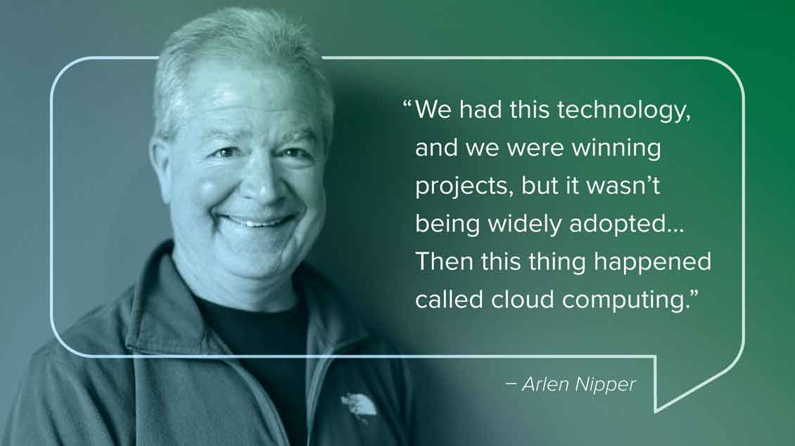

> MQTT是一个客户端服务端架构的发布/订阅模式的消息传输协议。它的设计思想是轻巧、开放、简单、规范，易于实现。
> 这些特点使得它对很多场景来说都是很好的选择，特别是对于受限的环境如机器与机器的通信（M2M）以及物联网环境（IoT）。
>
> ——MQTT协议规范中文版

以上MQTT (Message Queue Telemetry Transport 消息队列遥测传输) 协议规范中的介绍很好地描述了MQTT的全部含义。
它是一种很轻的通讯协议。与HTTP之类的协议相比，MQTT在通过网络传输数据时表现出众。该协议的另一个重要特点是易于在客户端实现。
因此，MQTT成为了当今世界上最受欢迎的物联网协议。它已广泛应用于车联网、智能家居、即时聊天应用和工业互联网等领域。
目前通过MQTT协议连接的设备已经过亿，这些都得益于MQTT 协议为设备提供了稳定、可靠、易用的通信基础。

### MQTT历史

MQTT协议最初版本是在1999年建立的。该协议的发明人是的Andy Stanford-Clark和Arlen Nipper。

*QTT协议发明人之一Andy-Stanford-Clark*

*MQTT协议发明人之一Arlen Nipper*

他们当时正在开发一个利用卫星通讯监控输油管道的项目。
为了实现这个项目要求，他们需要开发一种用于嵌入式设备的通讯协议，这种通讯协议必须满足以下条件：

* 易于实现
* 数据传输的服务质量可控
* 占用带宽小
* 传输数据内容不可预知
* 设备连接状态可知

从以上几点不难看出，MQTT 从诞生之初就是专为低带宽、高延迟或不可靠的网络而设计的。虽然历经几十年的更新和变化，以上这些特点仍然是MQTT协议的核心特点。
但是与最初不同的是，MQTT协议已经从嵌入式系统应用拓展到开放的物联网（IoT）领域。

### OASIS标准

*OASIS(结构化信息标准促进组织)*

2014年10月29日，MQTT成为OASIS（结构化信息标准促进组织）正式批准的通讯标准。
OASIS是一个推进电子商务标准的发展、融合与采纳的非盈利性国际化组织。
相比其他组织，OASIS形成了Web服务标准的同时也提出了安全的电子商务标准，同时在针对公众领域和特定应用市场的标准化方面也付出很多的努力。
自1993年成立开始，OASIS已经发展成为了由来自100多个国家的600多家组织、企业。
简言之，由众多业内专家组成的OASIS愿意为MQTT背书，组件该协议在物联网领域的重要性。

### MQTT版本

目前MQTT主流版本有两个，分别是MQTT3.1.1和MQTT5。MQTT3.1.1是在2014年10月发布的，而MQTT5是在2019年3月发布的。由于MQTT3.1.1与MQTT5的时间相差了将近五年，且MQTT5的发布时间距今不久，因此在本文书写时（2020年10月），MQTT3.1.1仍然主流版本。

MQTT5是在MQTT3.1.1的基础上进行了升级。因此MQTT5是完全兼容MQTT3.1.1的。而MQTT5是在MQTT3.1.1的基础上添加了更多的功能补充完善MQTT协议。

import Mqtt5andMqtt311Svg from './assets/mqtt5andmqtt311.drawio.svg'

<Mqtt5andMqtt311Svg />

*MQTT5与MQTT3.1.1的关系*

### 为什么不是http协议

大多数开发人员已经熟悉 HTTP Web 服务。那么，为什么不让物联网设备连接到Web服务呢？
设备可以作为 HTTP 请求发送其数据，并作为 HTTP 响应从系统接收更新。此请求和响应模式确实有一些严重的限制：

* HTTP 是一种同步协议。客户端等待服务器响应。这是Web浏览器的要求，但它的代价是可扩展性差。在物联网领域，大量的设备以及很可能是不可靠/高延迟的网络使同步通信成为问题。异步消息传递协议更适合 IoT 应用程序。传感器可以发送读数，并让网络确定交付到其目标设备和服务的最佳路径和时间。
* HTTP 是单向的。客户端必须启动连接。在物联网应用程序中，设备或传感器通常是客户端，这意味着它们不能被动地从网络接收命令。
* HTTP 是一个 一对一的协议。客户端发出请求，服务器响应。向网络上的所有设备广播消息既困难又昂贵，这是物联网应用中的常见用例。
* HTTP是一个重量级的协议,具有许多标头和规则.它不适用于受约束的网络.

由于上述原因，大多数高性能可扩展系统使用异步消息传递总线(而不是 Web 服务)进行内部数据交换.
实际上，企业中间件系统中使用的最流行的消息传递协议称为AMQP（高级消息队列协议）。但是，在高性能环境中，计算能力和网络延迟通常不是问题。AMQP 专为企业应用中的可靠性和互操作性而设计。
它具有丰富的功能集，但不适合资源受限的 IoT 应用程序。